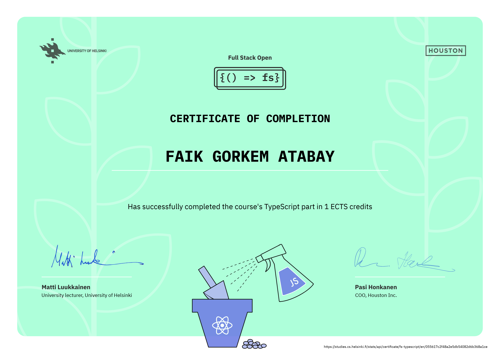

# Patientor App, Typescript

d-patientor-final directory contains final form of the app.

## d-patientor-final

## _patientor-backend_

Install the dependencies and start the server.

```sh
cd patientor-backend
npm install
npm start or npm run dev
```

Server will run on port 3001.

## _patientor-frontend_

- This part uses the server from [patientor-backend](#patientor-backend), so make sure the server is running before following the steps below.

Install the dependencies.

```sh
cd patientor-frontend
npm install
npm start
```

Check [localhost:3000](http://localhost:3000/) to see **Patientor** app.

---

> ## University of Helsinki Certificate


Certificate link: https://studies.cs.helsinki.fi/stats/api/certificate/fs-typescript/en/055617c2f48a2e5db54082d6b368a1ce
